<div align="center">

</div>

<br/>
<div align="center"> 

# 🌐 CSS Theoretical Questions
### 📖 A Complete Reference Guide with Code Examples & Visual References 🖼️


---

---

## 📌 Table of Contents

| # | Question | Level | Marks |
|:-:|----------|:-----:|:-----:|
| [01](#-q1--what-is-css--how-to-add-it) | What is CSS & How to Add It | 🟢 Beginner | 5 |
| [02](#-q2--css-selectors) | CSS Selectors | 🟢 Beginner | 8 |
| [03](#-q3--css-box-model) | CSS Box Model | 🟢 Beginner | 7 |
| [04](#-q4--css-colors) | CSS Colors | 🟢 Beginner | 6 |
| [05](#-q5--css-units) | CSS Units | 🟢 Beginner | 7 |
| [06](#-q6--specificity--cascade) | Specificity & Cascade | 🟡 Intermediate | 8 |
| [07](#-q7--css-flexbox) | CSS Flexbox | 🟡 Intermediate | 10 |
| [08](#-q8--pseudo-classes--pseudo-elements) | Pseudo-classes & Pseudo-elements | 🟡 Intermediate | 9 |
| [09](#-q9--transitions--animations) | Transitions & Animations | 🔴 Advanced | 10 |
| [10](#-q10--responsive-web-design) | Responsive Web Design | 🔴 Advanced | 10 |

---

<div align="center">

## 〔 🟢 BEGINNER · Q1 — Q5 〕

</div>

</div>


## `🎯 Question 1 `

## **What is CSS and how do you add it to an HTML page?**

> **CSS (Cascading Style Sheets)** is the styling language of the web. It separates visual presentation from HTML structure, giving developers precise control over layout, color, typography, spacing, and animation. Without CSS, every webpage is an unstyled wall of text.

---

## 🛠️ What Problem Does CSS Solve?
>Before CSS, layout and styling were mixed inside HTML tags (like `<font>` or `bgcolor`), making code messy and hard to maintain. CSS solves this by introducing **Separation of Concerns (SoC)**, allowing developers to manage structure (HTML) and presentation (CSS) completely separately.

## 🧩 Core Architectural Concepts Matrix

> The following comprehensive matrix summarizes the fundamental operational definitions, integration methodologies, and structural paradigms of Cascading Style Sheets (CSS) in modern web production:


| Key Technical Parameter | Explicit Definition & Engineering Resolution |
| :--- | :--- |
| **What CSS Stands For**                         | **Cascading Style Sheets.** *Cascading* refers to the deterministic browser algorithm that resolves styling conflicts via hierarchy, specificity, and source order. *Style Sheets* are the rule-based documents specifying how DOM nodes render. |
| **The Core Problem CSS Solves** | **Eliminates Structural Pollution & Coupling.** Prior to CSS, layout and styling tokens were mixed directly inside HTML tags (e.g., `<font>`, `bgcolor`), leading to unmaintainable, monolithic documents. CSS introduces **Separation of Concerns (SoC)** by decoupling content structure from presentation. |
| **The 3 Methods of Adding CSS** | 1. **External CSS (Standard):** Isolated `.css` sheet linked inside the document `<head>` via a `<link>` tag.<br>2. **Internal CSS (Embedded):** Scoped style declarations nested inside a `<style>` element in the HTML `<head>`.<br>3. **Inline CSS (Atomic):** Properties applied directly to an element node using the global `style=""` attribute. |
| **Why External CSS is Preferred** | • **Cache Optimization:** The client browser downloads and caches the standalone `.css` asset exactly once, speeding up downstream page loads.<br>• **Cascade Predictability:** Bypasses the aggressive specificity footprint (`1000 pts`) of inline overrides.<br>• **Team Scalability:** Allows concurrent asset modification without merge conflicts in core structural HTML templates. |
| **Render Engine Lifecycle** | The browser workflow layer that parses text stylesheets, calculates final computed values per node, maps layout geometry, and paints the final view state pixels onto the canvas viewport. |
| **Specificity Resolution** | The programmatic 4-element vector scoring system `[Inline, ID, Class, Element]` that measures selector weights to reliably decide which rule takes precedence during a styling conflict. |


## 🧩 Keyword Concepts

| Keyword | Meaning |
| :--- | :--- |
| **Cascading** | Styles flow from parent → child; later rules can override earlier ones. |
| **Separation of Concerns** | HTML handles structure, CSS handles presentation, and JS handles behaviour. |
| **Render Engine** | The browser parses CSS and paints pixels based on computed styles. |
| **Specificity** | The scoring system that decides which rule wins when two conflict. |

---

##  3. 📐 Three Methods of Adding CSS (With Code Tasks)

## ①Method A: <br>
#### External CSS — `<link>` tag ✅ `(Industry Standard)`

>Links an isolated text asset containing style definitions directly to an HTML file using a `<link>` structural wrapper element within the document `<head>`.

#### 💻 Code Implementation

```html
<!-- index.html -->
<!DOCTYPE html>
<html lang="en">
<head>
    <meta charset="UTF-8">
    <title>External CSS Example</title>
    <link rel="stylesheet" href="styles.css" />
</head>
<body>
    <h1>Hello World</h1>
</body>
</html>
```

```css
/* styles.css */
/* styles.css */
body {
    font-family: 'Segoe UI', sans-serif;
    background-color: #0f172a;
    color: #f1f5f9;
    margin: 0;
}
```

## ② Method B: <br>

#### Internal CSS — `<style>` block ⚠️ `(Single-page Only)`

>Embeds explicit declaration blocks within a scoped `<style>` element placed inside the document's `<head>`.

#### 💻 Code Implementation
```html
<!DOCTYPE html>
<html lang="en">
<head>
    <meta charset="UTF-8">
    <title>Internal CSS Example</title>
    <style>
        h1 {
            color: #7c3aed;
            font-size: 2rem;
        }
    </style>
</head>
<body>
    <h1>Hello World</h1>
</body>
</html>
```

## ③ Method C: <br>
#### Inline CSS  — `style=""` attribute ❌ `(Avoid in Production)`

>Injects key-value presentation declarations directly into an individual HTML tag using the native global `style` attribute wrapper.

#### 💻 Code Implementation

```html
<!DOCTYPE html>
<html lang="en">
<head>
    <meta charset="UTF-8">
    <title>Inline CSS Example</title>
</head>
<body>
    <p style="color: #db2777; font-size: 14px;">Avoid this in real projects.</p>
</body>
</html>
```

---

## 🏆 Method Comparison

| Criterion | External ✅ | Internal ⚠️ | Inline ❌ |
|-----------|:-----------:|:-----------:|:--------:|
| Reusable across pages | ✅ | ❌ | ❌ |
| Browser caches the file | ✅ | ❌ | ❌ |
| Clean HTML structure | ✅ | ⚠️ | ❌ |
| Team-friendly | ✅ | ⚠️ | ❌ |
| Overrides everything | — | — | ✅ (bad) |

## **📌 Recommended Method for Real Projects::** <br>
>`External CSS` is highly recommended for production/real-world projects because it ensures complete separation of concerns, enables browser caching to improve performance, and keeps the code maintainable for engineering teams.

## **🛠️ Why External CSS is Preferred Over Inline CSS:** <br>
><br>1.`Browser Cache Optimization:` The client browser downloads an external .css asset file exactly once. It caches this layout layer locally across subsequent navigation patterns, removing the need to fetch repetitive design logic on every new page view. Inline styles bloat every document payload with duplicate, uncacheable bytes.<br>
2.`Specificity & Cascade Control:` Inline styles inject rules directly at the highest standard priority tier inside the browser engine's cascade calculations, carrying a crushing specificity weight score of 1000 points. This heavy footprint makes targeting global modifications via stylesheets incredibly difficult without writing messy, anti-pattern overrides like !important.<br>
3.`Developer Ergonomics and Team Scalability:` Separating styling logic from structural code allows engineering teams to modify layout assets concurrently without tripping over merge conflicts in core HTML views or application route templates.

## `🖼️ Visual Reference`


---

## `🎯 Question 2 `

## **Explain CSS Selectors with examples?**

> **CSS Selectors** are targeting patterns that tell the browser's render engine exactly which HTML element(s) to apply styles to. Every CSS ruleset begins with a selector, mapping visual declarations to structural nodes in the `DOM tree`.

---

## 🧩 Key Concepts & Core Answers

| Question | Technical Answer |
| :--- | :--- |
| **Class vs ID — Highest Specificity?** | **ID Selector** has a significantly higher weight score (**100 points**) compared to a Class Selector (**10 points**). |
| **Direct Child vs Any Descendant?** | **Child (`>`)** only targets elements exactly one level down. **Descendant (space)** targets matching elements at any nesting depth. |
| **Same Class on multiple elements?** | ✅ **Yes**. Classes are explicitly designed to be reusable utility blueprints. |
| **Same ID on multiple elements?** | ❌ **No**. The HTML specification mandates that an ID must be unique per document. |

---

## 📐 All 7 Selector Types (With Valid HTML & CSS Implementation)

### **1. Universal Selector `(*)`**

> Targets every single element globally within the DOM tree. It is primarily used by engineers to overwrite default browser agent stylesheets and establish a unified baseline padding, margin, and box-sizing constraint.

#### 💻 Code Implementation

```html
<!-- index.html -->
<main>
  <div>
    <section>Global Reset Layout Matrix</section>
  </div>
</main>
```

```css
/* styles.css */
* {
  box-sizing: border-box;
  margin: 0;
  padding: 0;
}
```

---
### **2. Element / Type Selector `(element)`**

> Matches and updates all structural nodes matching that exact HTML tag configuration across the entire document layer

#### 💻 Code Implementation

```html
<!-- index.html -->
<p>This structural node will receive standard typography mapping.</p>
<p>Every subsequent paragraph shares this identical presentation blueprint.</p>
```

```css
/* styles.css */
p {
  font-size: 1rem;
  line-height: 1.7;
  color: #334155;
}
```

---

### **3. Class Selector `(.class)`**

> Targets any element carrying the matching global `class` attribute. It is highly reusable and serves as the fundamental building block for modular `Component-Driven Development (CDD)`.

#### 💻 Code Implementation

```html
<!-- index.html -->
<div class="card">Modular Component Interface A</div>
<div class="card">Modular Component Interface B</div>
```

```css
/* styles.css */
.card {
  background: #1e293b;
  border-radius: 12px;
  padding: 1.5rem;
  border: 1px solid #334155;
}
```

---

### **4. ID Selector `(#id)`**

> Targets a solitary, entirely unique structural identifier inside the document scope. The HTML ecosystem strictly enforces that no two active nodes can share the same ID token.

#### 💻 Code Implementation

```html
<!-- index.html -->
<section id="hero">Unique Landmark Viewport Hook</section>
```

```css
/* styles.css */
#hero {
  min-height: 100vh;
  display: flex;
  align-items: center;
  justify-content: center;
}
```

---

### **5. Grouping Selector `(comma separated)`**

> Aggregates distinct targeting configurations to share a unified block of declaration properties. This directly implements the DRY (Don't Repeat Yourself) architectural principle to keep stylesheet payloads minimal.

#### 💻 Code Implementation

```html
<!-- index.html -->
<h1>Main Document Title</h1>
<h2>Section Sub-Header Node</h2>
```

```css
/* styles.css */
h1, h2, h3, h4 {
  font-family: 'Georgia', serif;
  color: #7c3aed;
  margin-bottom: 0.75rem;
}
```

---

### **6. Descendant Selector `(space combinator)`**

> Recursively matches any target element nested anywhere deeper within the specified structural parent node boundary, traversing down infinite levels of the` DOM hierarchy tree`.

#### 💻 Code Implementation

```html
<!-- index.html -->
<div class="card">
  <article>
    <p>This nested content is a deep descendant node of the card wrapper.</p>
  </article>
</div>
```

```css
/* styles.css */
.card p {
  color: #94a3b8;
  font-size: 0.95rem;
}
```

---

### **7. Child Selector `(> combinator)`**

> Strictly matches elements that exist exactly one branch step down from the direct parent container node. It deliberately ignores grandchildren or any element locked inside deeper nested layers.

#### 💻 Code Implementation

```html
<!-- index.html -->
<ul class="parent-list">
  <li>Direct Child Node (This element will be styled)</li>
  <li>
    <div>
      <p>Nested Grandchild Node (Explicitly ignored by the child selector)</p>
    </div>
  </li>
</ul>
```

```css
/* styles.css */
.parent-list > li {
  padding: 0.5rem 0;
  border-bottom: 1px solid #e2e8f0;
}
```

---
## 🆚 Class vs ID — Architectural Decision Rule

>From a modern software architecture perspective, your usage rule should be clear, strict, and driven by semantic specifications:

### **1. When to use a Class `(.blueprint)` — Reusable Elements**

> Classes are explicitly designed to be dynamic blueprints reused across multiple elements on a single page or throughout an entire application stack. Even if an element appears only once on a view right now (like a primary button), you should still declare it as a class if it conceptually represents a shareable interface element.

#### 💻 Code Implementation

```html
<!-- index.html -->
<button class="btn-primary">Submit Form</button>
<button class="btn-primary">Cancel Operation</button>
```

```css
/* styles.css */
.btn-primary {
  background: #7c3aed;
  color: #ffffff;
  padding: 0.75rem 1.5rem;
  border-radius: 8px;
  cursor: pointer;
}
```

### **2. When to use an ID `(#landmark)` — Unique Identifiers**

> The HTML specification strictly mandates that an ID must be completely unique within the document scope. You must never use the same ID on multiple elements, as it violates semantic rules and breaks JavaScript integrations. Reserve IDs exclusively as functional hooks for client-side scripts, anchor layout links `(href="#main-content")`, or globally unique interface structural wrappers.

#### 💻 Code Implementation

```html
<!-- index.html -->
<nav id="main-nav">
  </nav>
```

```css
/* styles.css */
#main-nav {
  position: sticky;
  top: 0;
  z-index: 999;
  background: #0f172a;
}
```

## **💡 Core Architectural Rule:** <br>
>Default to classes for `99%` of your styling tasks. Avoid using IDs inside your stylesheets because their extremely high weight score inside the Specificity Hierarchy disrupts the natural cascade ecosystem, making global project updates and code maintenance difficult.

## `🖼️ Visual Reference`


---

## `🎯 Question 3  `

## **What is the CSS Box Model? Explain each layer**

> Every HTML element parsed by the browser's render engine is modeled as a structured **rectangular box**. The CSS Box Model is the foundational specification that dictates exactly how an element's spatial dimensions, internal breathing room, and external boundaries are calculated and rendered.

---

## 🧩 Key Concepts & Core Answers

| Requirement Check | Technical Layout Answer |
| :--- | :--- |
| **Which layer is the innermost?** | **Content Layer** — The core dimensional nucleus where the element's raw text, images, or child nodes reside. |
| **Is padding inside or outside the border?** | **Inside** — Padding is the internal structural clearing located between the content node and the border boundary, absorbing the element's background color. |
| **What does `margin: 0 auto` do to a block element?** | Sets the vertical margins to `0` and dynamically calculates equal horizontal spacing, centering the block element inside its parent container. |
| **With `border-box`, does width include padding?** | ✅ **Yes**. The calculated layout width is immutable; it automatically incorporates `width = content + padding + border`. |

---

## 📐 The Four Layers — Structural Descriptions


#### 1. Content Layer
>* **Role:** The innermost nucleus of the box.
>* **Control:** It directly houses the native node payloads such as typography strings, multimedia assets, or nested child elements. Under standard rules, its dimensions are manipulated via the `width` and `height` properties.

#### 2. Padding Layer (Internal Clearance)
>* **Role:** The internal breathing room of the component.
>* **Control:** It creates defensive padding space between the core text content and the outer structural frame. Because it sits inside the perimeter, it dynamically displays the element's background color or linear gradients.

#### 3. Border Layer (Structural Frame)
>* **Role:** The visible boundary outline of the element box.
>* **Control:** It serves as a visual separator wrapping the content and padding layers. It is configurable via thickness values, style choices (`solid`, `dashed`), and paint colors.

#### 4. Margin Layer (External Separation)
>* **Role:** The outermost defensive shield.
>* **Control:** It generates empty, entirely transparent buffer space between the current element and neighboring nodes on the page. Margins never absorb background elements and are utilized to control global component stacking behavior.

---

## 📐 Structural Comparison Matrix

| Layer Parameter | Control Scope | Transparent Constraints |
| :--- | :--- | :---: |
| **Content** | Primary structural node payload | Dependent on children |
| **Padding** | Inner spatial defensive buffer | ❌ Inherits background styles |
| **Border** | Visible peripheral frame mapping | ❌ Rendered vector line |
| **Margin** | External separation boundaries | ✅ Always Transparent |

---

---

## 📐 The Four Layers — Visualised

```
╔═══════════════════════════════════════════════╗  ← MARGIN
║  (always transparent — creates space outside) ║
║  ╔═════════════════════════════════════════╗  ║  ← BORDER
║  ║  (visible frame: color, width, style)  ║  ║
║  ║  ╔═══════════════════════════════════╗  ║  ║  ← PADDING
║  ║  ║  (breathing room, bg color shows) ║  ║  ║
║  ║  ║  ╔═════════════════════════════╗  ║  ║  ║  ← CONTENT
║  ║  ║  ║   text · images · children  ║  ║  ║  ║
║  ║  ║  ╚═════════════════════════════╝  ║  ║  ║
║  ║  ╚═══════════════════════════════════╝  ║  ║
║  ╚═════════════════════════════════════════╝  ║
╚═══════════════════════════════════════════════╝
```

| Layer | Controls | Transparent? |
|-------|----------|:------------:|
| **Content** | Text, images, children | — |
| **Padding** | Inner breathing room | ❌ (bg color shows) |
| **Border** | Visible frame around element | ❌ |
| **Margin** | Space between elements | ✅ Always |

---

##  🆚 Box Sizing: `content-box` vs `border-box` (The Layout Math)

#### 1. Legacy Approach: `content-box` (The Anti-Pattern)<br>
>Under this default specification model, the browser maps the assigned width property directly to the inner content layer only. When you add padding and borders, the element expands outward dynamically, inflating the actual rendered footprint on the viewport and breaking responsive layouts.

#### 💻 Code Implementation
```css
/* ❌ Mathematical Redundancy & Formula:
   Total Outer Width = 300px (width) + 40px (paddings) + 4px (borders) = 344px rendered width on screen.
   (Margin adds another 16px of external spacing around this inflated box). */
.legacy-box {
  box-sizing: content-box;
  width: 300px;
  padding: 20px;
  border: 2px solid #7c3aed;
  margin: 16px;
}

```

#### 2. Production Approach: border-box (The Professional Code Task Standard)<br>
>This modern layout approach forces the browser's render engine to treat the assigned width property as the definitive total outer footprint on the view. If padding or borders are scaled up, the content nucleus automatically shrinks inward to compensate.

#### 💻 Code Implementation
```css

/* ✅ Fluid Layout Architecture Formula: Exactly 300px total outer width constraint. 
   The content core automatically contracts down to 256px (300 - 40 - 4) to preserve your container constraints perfectly. */
.box {
  box-sizing: border-box;
  width: 300px;
  padding: 20px;
  border: 2px solid #7c3aed;
  margin: 16px;
  background: #1e293b;
  color: #f1f5f9;
  border-radius: 8px;
}

```
#### 🏆 Architectural Industry Standard Verdict<br>
>In enterprise-level web engineering, border-box is globally mandatory. Modern responsive ecosystems, flexible multi-device design fluid matrices, and UI components cannot scale reliably if paddings alter container footprints.<br>
To eliminate mathematical redundancy entirely, every modern boilerplate initiates layout setups using a unified global box reset targeting both native tags and global pseudo-elements to ensure predictable layout math across the entire codebase:

#### 💻 Code Implementation
```css
/* Global Structural Reset Strategy applied across production-grade apps */
*, 
*::before, 
*::after {
  box-sizing: border-box;
  margin: 0;
  padding: 0;
}

```

## `🖼️ Visual Reference`


---

## `🎯 Question 4 `

## **Explain CSS Colors. What are the different ways to define a color?**


> Color implementation dictates the **emotional interface layer** and sensory design hierarchy of a web application. Modern CSS engines interpret color values across multiple dynamic coordinate systems, allowing developers to manipulate vibrancy, saturation grids, and alpha channel translucency values programmatically.

---

## 🧩 Key Concepts & Core Answers

| Requirement Evaluation | High-End Software Engineering Specification |
| :--- | :--- |
| **Which format is most commonly used by developers?** | **HEX (Hexadecimal)** — It is the industry standard for layout hands-off, offering direct copy-paste alignment from design tools like Figma, absolute browser optimization, and compact string notation. |
| **What does the 'A' in RGBA stand for?** | **Alpha Channel** — An independent parameter that controls structural opacity and translucency levels, scaling from `0.0` (completely transparent) to `1.0` (fully opaque). |
| **Does `opacity` affect child elements?** | ✅ **Yes**. The `opacity` property modifies the entire rendered layout subtree node globally. All child components inherit this alpha multiplier and become transparent recursively. |
| **Does `rgba` alpha affect children?** | ❌ **No**. The alpha channel inside `rgba()` applies explicitly only to the target property (e.g., `background-color`). Nested text nodes and children retain 100% solid opacity. |

---

## 🔬 Color Space Architecture & System-Level Sizing Specifications

>Below is the deep-dive engineering breakdown tracking the specific Figma design token value **`#F97316`** across all standard browser rendering pipelines.

## 1. Named System `(Semantic Key Strings)`

#### 📝 Architectural Description
> **Under the Hood:** The browser engine maps a rigid, pre-compiled dictionary of exactly 140 W3C-standardized English string words directly to fixed internal color definitions.
> **Production Trade-off:** Because it uses fixed strings, custom design tokens or micro-adjusted branding assets cannot be captured natively. In production, this system is almost completely avoided to protect color precision.

#### 💻 Code Implementation
```css
/* NOTE: The exact Figma hex token #F97316 does not have a 100% native 1-to-1 keyword string name match 
   in the limited standard CSS web palette. The architectural engine approaches include: */

.color-named-match { 
  color: darkorange; /* Closest semantic W3C web-safe keyword approximation */
}
```
---

## 2. Hexadecimal System `(Base-16 Channel Matrix)`:

#### 📝 Architectural Description
> Under the Hood: A base-16 mathematical notation shorthand that compacts `24-bit color` data into a single string. It reads character pairs sequentially representing Red, Green, and Blue intensities.
Mathematical Formula Breakdown `(#F97316)`:
`F9` (Red Channel) → Resolves to decimal intensity `249` (dominant channel).
`73` (Green Channel) → Resolves to decimal intensity `115` (mid-tone scaling).
`16` (Blue Channel) → Resolves to decimal intensity `22` (low suppression).

#### 💻 Code Implementation
```css
/* Base-16 character notation representing Red (F9), Green (73), and Blue (16) color matrices. */

.color-hex { 
  color: #F97316; /* Direct Figma token alignment — Production Standard */
}
```
---
## 3. RGB System `(Hardware Light Modulation)`:

#### 📝 Architectural Description
> Under the Hood: This format hooks directly into the physical screen's hardware emission sub-pixels. It calculates light vectors on a standard integer scale from `0 `(absolute zero light emission) to `255` (maximum channel emission saturation).<br>
Render Logic `(rgb(249, 115, 22))`:<br> The rendering engine instructs the viewport device to ignite the Red sub-pixel at 97.6% capacity, the Green at 45%, and suppress the Blue channel down to 8.6%, projecting the identical orange hue.

#### 💻 Code Implementation
```css
/* Integer matrix model parsing intensity channels on a dynamic spectrum scale from 0 to 255. */

.color-rgb { 
  color: rgb(249, 115, 22); 
}
```
---

## 4. RGBA System `(Encapsulated Composite Layering)`:

#### 📝 Architectural Description
> Under the Hood: An architectural expansion of the standard RGB color channel matrix that introduces a dedicated 4th parameter data lane—the Alpha Channel—to govern alpha blending and canvas pixel compositing layers.<br>
Solid Vector Control `(rgba(249, 115, 22, 1.0))`:<br> Setting the trailing constraint to exactly `1.0` binds the paint density to a fully solid, non-transparent vector mask, preventing behind-the-element layouts from bleeding through.

#### 💻 Code Implementation
```css
/* RGB model expanded with an explicit 4th parameter to map absolute paint density opacity. 
   Using a 1.0 alpha constraint ensures a 100% opaque match to the base token color. */

.color-rgba { 
  color: rgba(249, 115, 22, 1.0); /* Absolute solid vector match */
}
```
---

## 5. HSL System `(Cylindrical Coordinate Geometry)`:

#### 📝 Architectural Description

> Under the Hood: A modern coordinate system that aligns perfectly with human color perception mechanics instead of hardware pixel configurations. It isolates the raw color tone completely from its vividness or brightness metrics.<br>
Mathematical Coordinate Breakdown (hsl(24, 94%, 53%)):<br>
<br> 1.`Hue (24°)`: A positional angle vector mapped on a continuous `360 color` circle spectrum, identifying the base pure orange wave lane.<br>
2.`Saturation (94%)`: The density percentage defining color purity `(100% is deep intense color; 0% drops into a pure monochrome grayscale filter)`.<br>
3.`Lightness (53%)`: The balance percentage determining white/black value mix `(0% forces solid black, 100% yields white, and 53% guarantees a stable middle-ground tone)`.


#### 💻 Code Implementation
```css
/* Cylindrical-coordinate mathematical system: Hue (24° vector), Saturation (94%), and Lightness (53%). 
   Highly intuitive for implementing mathematical design systems and theme generators. */

.color-hsl { 
  color: hsl(24, 94%, 53%); 
}
```
---

## 📐 Compounding Opacity vs Encapsulated Alpha Channels

**1. Global Component Degradation:** `opacity: 0.5`<br>

><br>The opacity property alters the compositing layer of the element container inside the browser rendering viewport. This causes severe UX accessibility layout bugs because text readability drops when children inherit parent transparency.

#### 💻 Code Implementation
```css
/* ❌ The Anti-Pattern for UI Containers: Entire element node subtree fades together */
.card-overlay-faulty {
  background-color: #000000;
  opacity: 0.5;        /* Critical Bug: Nested heading strings and child icons become 50% invisible */
  color: #FFFFFF;
}
```
**2. Encapsulated Component Isolation: `rgba()`** <br>

><br>By explicitly altering only the target property's channel vector via alpha parameters, the parent backdrop absorbs the opacity change while nested content assets maintain structural solid rendering.

#### 💻 Code Implementation
```css
/* ✅ Production Architecture Standard: Alpha encapsulation protects nested layouts */
.card-overlay-isolated {
  background-color: rgba(0, 0, 0, 0.5); /* 50% transparent background vector layer */
  color: #FFFFFF;                       /* Structural child typography text remains 100% solid white */
}
```

## **🏆 Design System Integration Rule:** <br>

**Architectural Best Practice:**<br>
><br> Utilize encapsulated channel values `(rgba()` or modern `hsl(h s l / a))` to safely construct complex overlay backgrounds, dynamic component layouts, and glassmorphism textures. Restrict the use of the global `opacity` property exclusively to temporary UI status switches, such as rendering a disabled form element `(.btn:disabled { opacity: 0.4; })` where the degradation of the entire container is intentionally expected by the user.


### `🖼️ Visual Reference`


---

## `🎯 Question 5 `

## **What are CSS Units? Explain px, %, rem, em, vh, and vw.**

> Master Specification: Modern CSS Sizing Units & Responsive Architecture

> CSS units serve as the core mathematical measurement vocabulary of responsive web layouts and interface typesetting. Choosing static, inflexible constraints causes structural layout failure on alternative display formats. Implementing relative, contextual units ensures a layout scales dynamically and seamlessly across arbitrary physical viewports, rendering screens, and assistive user preference layers.

---

## 🧩 Key Concepts & Core Technical Answers

| Core Requirement Check | Enterprise Layout Architectural Specification |
| :--- | :--- |
| **What is `1rem` equal to by default?** | **16px** — By absolute browser layout engine specification, `1rem` maps contextually to the computed baseline font-size parameter inherited from the document root (`<html>`) node element. |
| **`%` (Percentage) is relative to parent or root?** | **The Parent Element** — Percentage metrics evaluate contextually relative to the computed physical layout box dimensions assigned explicitly to the immediate parent component node layer. |
| **What does the unit `vh` stand for?** | **Viewport Height** — A dedicated structural sizing unit coordinate profile where exactly `1vh` represents exactly $1\%$ of the browser window's active viewport height axis. |
| **Why is `rem` preferred over `px` for font-size accessibility?** | **User-Agent Scale Preservation** — `px` locks the layout engine to hardcoded hardware pixels, completely blocking manual accessibility overrides. `rem` dynamically scales text modules, allowing the UI layout to seamlessly enlarge when users modify their global system font preference scales. |

---

## 📐 The CSS Units Golden Rules Framework

>Production architectural standards mandate strict separation of concerns when assigning measurement units to interface layers:

>* **For Typographic Font Sizes $\rightarrow$ Always Prefer `rem`:** Guarantees universal browser accessibility compliance and respects native user font adjustments dynamically.
>* **For Element Component Widths $\rightarrow$ Always Prefer `%` or `vw`:** Establishes responsive box fluidity and protects horizontal component layout dimensions from triggering unexpected side-scroll breakages.
>* **For Full-Screen Structural Blocks $\rightarrow$ Always Prefer `vh`:** Forces full-screen element layouts, container sections, and landing page backdrops to reliably span the active vertical screen viewport boundaries.

---


## 📐 Six Units — Reference Table

| Unit | Relative To | Best Used For | Example |
|------|-------------|---------------|---------|
| `px` | Nothing (absolute) | Borders, box-shadows, icon sizes | `border: 1px solid` |
| `%` | Parent's size | Fluid widths, image fills | `width: 100%` |
| `rem` | Root `<html>` font-size | Font sizes, spacing scales | `font-size: 1.5rem` |
| `em` | Current element's font-size | Padding/margin relative to text | `padding: 0.75em 1em` |
| `vh` | Viewport height | Hero sections, full-screen areas | `min-height: 100vh` |
| `vw` | Viewport width | Full-bleed layouts, fluid type | `font-size: 5vw` |

---

## 📐 Structural Unit Resolution & Implementation Matrix

>The browser layout engine calculates spacing boundaries differently depending on whether it parses absolute hardware units or relative system variables:

#### 1. Pixels (`px`) — The Absolute Baseline
>* **Internal Resolution:** Represents a fixed, static physical device screen pixel coordinate mapping.
?* **Practical Use Case:** Fine micro borders, structural component box-shadow limits, and vector SVG container dimensions that must preserve precision metrics regardless of layout scale changes.

>* **Production Syntax Example:**

#### 💻 Code Implementation
  ```css
  .card-container { border: 1px solid #e5e7eb; box-shadow: 0 4px 6px -1px rgba(0, 0, 0, 0.1); }
```
#### 2. Percentage (%) — The Fluid Component Relative

>Internal Resolution: Resolves dynamically against the exact active cross-axis boundary footprint of its closest parent element block wrapper.
Practical Use Case: Constructing flexible multi-column layouts, building adaptive sidebar widths, or creating responsive inner media asset wrappers.

>* **Production Syntax Example:**

#### 💻 Code Implementation
  ```css
 .main-content-layout { width: 75%; float: left; }
```

#### 3. Root Em (rem) — The Accessibility Gatekeeper

>Internal Resolution: References the baseline computed font-size parameter config of the document root (<html>). If root evaluates to 16px, 2.5rem translates to exactly 40px at runtime.
Practical Use Case: Global typography systems, accessible layout margins, outer section padding grids, and fluid system component boundaries.

>* **Production Syntax Example:**

#### 💻 Code Implementation
  ```css
 .article-title { font-size: 2.25rem; margin-bottom: 1.25rem; }
```


#### 4. Element Em (em) — The Local Contextual Proportional

>Internal Resolution: Tracks the local inherited computed font-size of the exact specific node layer on which it is applied.
Practical Use Case: Crafting standalone UI micro-components (like badges, chips, or action buttons) whose layout spacing needs to scale in perfect proportion to their local text shifts.

>* **Production Syntax Example:**

#### 💻 Code Implementation
  ```css
.btn-action-primary { font-size: 1.25rem; padding: 0.5em 1em; } /* Spacing updates dynamically if font-size changes */
```

#### 5. Viewport Height (vh) — The Vertical Canvas Specifier

>Internal Resolution: Coordinates directly with 1% of the live vertical browser viewing frame axis window bounds.
Practical Use Case: Defining structural interface hero boundaries, application sidebar heights, full-page modal frames, or zero-flicker landing sections.

>* **Production Syntax Example:**

#### 💻 Code Implementation
  ```css
.app-sidebar-navigation { height: 100vh; position: fixed; }
```

#### 6. Viewport Width (vw) — The Horizontal Canvas Specifier

>Internal Resolution: Coordinates directly with 1% of the live horizontal browser viewing frame axis window bounds.
Practical Use Case: Engineering large horizontal grid tracks, full-bleed breakout layout strips, or serving as the adaptive scaling driver inside fluid sizing expressions.

>* **Production Syntax Example:**

#### 💻 Code Implementation
  ```css
.full-bleed-banner-canvas { width: 100vw; margin-left: calc(50% - 50vw); }
```

## **📐 Production Layout Engineering Framework**

>This implementation details an adaptive layout module that satisfies the responsive fluid conditions without the reliance on rigid media-query breakpoints:
>
#### 💻 Code Implementation

```css
/*
   📐 PRODUCTION ENGINEERING SYSTEM SCHEMA
   ───────────────────────────────────────────────────────────────────────────
   1. Typographic Hierarchies     → rem  (Preserves Global Access Preferences)
   2. Horizontal Container Bounds → %    (Ensures Lateral Component Fluidity)
   3. Max-Width Enforcements      → rem  (Locks Optimal Typographic Run Lengths)
   4. Screen Block Heights        → vh   (Locks Screen-Filling Viewport Fit)
*/

.hero-container {
  /* Fulfills Core Task: Locks component to full vertical viewport height */
  min-height: 100vh;
  
  /* Binds structural footprint fluidly to total parent canvas availability */
  width: 100%;
  
  /* Fulfills Core Task: Implements upper limiting lock in rem (~1280px absolute cap) */
  max-width: 80rem;
  
  /* Automated margins split horizontal spaces evenly to center the box container */
  margin-right: auto;
  margin-left: auto;
  
  /* Relative margin padding scales proportionately with root text metrics */
  padding-top: 4rem;
  padding-bottom: 4rem;
  padding-right: 2rem;
  padding-left: 2rem;
  
  /* Enforces a vertical flexbox axis to securely align child layout elements */
  display: flex;
  flex-direction: column;
  justify-content: center;
  align-items: center;
  text-align: center;
  box-sizing: border-box; /* Forces padding to adjust inward, preventing outward blowout */
}

.hero-container .hero-title {
  /* Fulfills Core Task: Implements responsive type scaling via fluid clamp logic. 
     Scales typography linearly from 32px (2rem) up to 72px (4.5rem) 
     using 5% of horizontal viewport width (5vw) as the active scaling factor. */
  font-size: clamp(2rem, 5vw, 4.5rem);
  
  /* Tight line density layout ideal for multi-line hero displays */
  line-height: 1.15;
  margin-bottom: 1.5rem;
}

.hero-container .hero-description {
  /* Fluid Body Scaling: Adapts systematically between 16px (1rem) and 20px (1.25rem) */
  font-size: clamp(1rem, 2.5vw, 1.25rem);
  
  /* Restricts maximum paragraph layout width to protect eye scan run comfort */
  max-width: 45rem;
  
  /* Relaxed line height configuration prevents text line collision */
  line-height: 1.6;
  
  /* Accessible contrast color token output */
  color: #4b5563;
}

```

## **🏆 Enterprise Architecture Integration Verdict**

💡 **Architectural Best Practice Rule:**
>Mixing static hardcoded dimensions (`px`) with relative, fluid properties (`%, vw, rem`) inside a unified container element introduces high rendering conflict risks. Modern fluid layouts rely heavily on the `clamp()` CSS mathematical function, which serves as the production engine standard. It creates boundary limits (`minimum, preferred scaling vector, maximum`) that allow text layers and structural boundaries to resize automatically between various screen form factors without breaking container frames.

## 📐 Design System Token Distribution Matrix:
>* **For Font Sizes $\rightarrow$ Enforce `rem`:** This guarantees universal accessibility compliance and ensures readable interfaces by honoring browser font preference scales.
>* **For Widths $\rightarrow$ Enforce `%` or `vw`:** This ensures structural layouts expand or contract fluidly based on available space, eliminating horizontal overflow and unwanted side-scroll bugs.
>* **For Full-Screen Sections $\rightarrow$ Enforce `vh`:** This forces heavy operational components like hero sliders and introduction splash screens to reliably span the active vertical screen area.

## ` 🖼️ Visual Reference`


---

<div align="center">

### 〔 🟡 INTERMEDIATE · Q6 — Q8 〕

</div>

---

## `🎯 Question 6 `

## **What is CSS Specificity and how does the Cascade work?**

>   Academic Specification: CSS Specificity & Cascade Resolution Engine

> **Engineering Overview:** The CSS Cascade (Cascading Style Sheets) is a foundational deterministic layout engine algorithm tasked with resolving styling token value conflicts when multiple source rules compete to paint a shared DOM node target. Rather than acting as an unpredictable rule engine, the browser parsing workflow runs a strict, multi-tiered filtering funnel that evaluates source origin, selector specificity math, and lexical source location to establish a predictable, pixel-perfect computed view state.

---


## 🧩 1. Executive Summary: Core Specificity Resolution Matrix

>The following comprehensive evaluation matrix details the core priority behaviors of the cascading engine when computing selector weights and inline overrides:

| Core Evaluation Check | Engineering Rule Outcome | Mathematical Vector Weight | Comprehensive Browser Engine Architecture Resolution |
| :--- | :--- | :--- | :--- |
| **Class vs. Element Selector Priority** | **Class Selector Wins** | `[0, 0, 1, 0]` ($+10\text{ pts}$) vs. `[0, 0, 0, 1]` ($+1\text{ pt}$) | The parsing engine evaluates specificity arrays from left to right. A class selector injects value into a higher-magnitude column tier, completely overriding element rules regardless of their relative source ordering file positions. |
| **Inline Style Specificity Metric** | **Inline Attribute Priority** | `[1, 0, 0, 0]` ($1000\text{ pts}$ theoretical baseline) | Attaching styles directly within DOM elements using the `style="..."` parameter bypasses the standard style block hierarchy. It establishes immediate dominance over any matching external styles or internal document-level style tags. |
| **Tiebreaker for Identical Scores** | **Source Order Override** | *Mathematical Equalization* (Tie Condition) | When competing rules evaluate to identical vector metrics, the layout compiler switches to lexical source placement rules. Reading from top to bottom, the style token parsed last down the execution path overwrites previous specifications. |
| **The Behavior of `!important` Flags** | **Absolute Cascade Disruption** | `[∞, 0, 0, 0]` (Infinity Tier Bypass) | The `!important` modifier bypasses normal specificity loops by moving individual property tokens into the browser's high-priority Origin Pool. It overrides inline configurations, unique IDs, classes, and base layout element declarations instantly. |

---

---

## 📐 2. The Specificity Vector Scoring System

>In academic browser documentation, specificity is modeled as a 4-element vector array: **`[Inline, ID, Class, Element]`**. These values do not simply sum up into a base-10 integer; instead, weight categories act as distinct orders of magnitude that cannot be overtaken by lower-tier selectors (i.e., 11 element selectors can never outvote a single class selector).

---

### 📐 Specificity Scoring System

```
┌──────────────────────────────────────────────────────────┐
│  COLUMN  [A]    [B]     [C]     [D]                      │
│                                                          │
│  [A]  Inline styles          →  1000 pts                 │
│  [B]  ID selectors           →   100 pts each            │
│  [C]  Class, attribute,                                  │
│       pseudo-class           →    10 pts each            │
│  [D]  Element, pseudo-element →    1 pt each             │
│                                                          │
│  Universal (*)               →     0 pts                 │
│  !important                  →  ∞  (nuclear override)    │
└──────────────────────────────────────────────────────────┘
```


### 🧮 Selector Weight Evaluation Matrix

>The following table breaks down how the browser's style parsing engine calculates specific CSS rules into vector arrays to establish priority:

| Selector Structure Blueprint | Vector Composition Analysis | Combined Mathematical Score | Absolute Structural Purpose |
| :--- | :--- | :--- | :--- |
| `*` | `[0, 0, 0, 0]` | **0** | **Universal Reset:** Applies baseline system defaults without altering specificity metrics. |
| `p` | `[0, 0, 0, 1]` | **1** | **Element Baseline:** Assigns wide structural defaults across global HTML node categories. |
| `.card` | `[0, 0, 1, 0]` | **10** | **Component Token:** Defines modular styles for reusable interface components. |
| `p.card` | `[0, 0, 1, 1]` | **11** | **Qualified Element Class:** Scopes a component variant style specifically to an explicit HTML tag. |
| `#hero` | `[0, 1, 0, 0]` | **100** | **Unique Structural Anchor:** Targets singular, high-priority page regions (e.g., navigation arrays). |
| `div#hero .status span` | `[0, 1, 1, 2]` | **112** | **Complex Compound Path:** Tracks nested elements securely down a deep DOM hierarchy stream. |
| `style="color: blue;"` | `[1, 0, 0, 0]` | **1000** | **Inline Override:** Injecting style attributes directly into a markup tag to force localized overrides. |
| `color: blue !important;` | `[∞, 0, 0, 0]` | **Infinity** | **Bypass Flag:** Manually elevates a single property declaration to the highest origin category tier. |

---

## 🏛️ 3. How the Cascade Works — The Three Core Pillars

>When building modern user interfaces, styles resolve through an organized pipeline where properties flow through three sequential evaluation gates:

---

### 📐 How the Cascade Works — Three Pillars

```
[ THE BROWSER COMPILATION STREAM ]
📄 Competing Rules Targeting Single Node
│
▼
┌──────────────────────────────┐
│  PILLAR 1: SPECIFICITY       │ ──► Evaluates vector math scores
└──────────────────────────────┘     (Class [10] beats Element [1])
│
▼
┌──────────────────────────────┐
│  PILLAR 2: SOURCE ORDER      │ ──► Breaks ties using position
└──────────────────────────────┘     (Latest declared token overwrites)
│
▼
┌──────────────────────────────┐
│  PILLAR 3: INHERITANCE       │ ──►<br> Passes unassigned typography rules
└──────────────────────────────┘     from ancestor to child node
│
▼
<br>🎨 Final Computed Paint Properties
```

## **Three Pillars**

### Pillar 1: Specificity Resolution Mechanics
>The engine first filters competing rules by evaluating their selector weight arrays. Higher-tier selector weights override lower ones immediately. The layout engine processes these values from left to right across the vector layout columns, and if any mismatch is caught early on, the lower-scoring rule is discarded regardless of any downstream values.

### Pillar 2: Source Order Logic
>If multiple rule chains produce identical specificity vector values, the cascade relies on source positioning to break the tie. The engine reads files in top-to-bottom reading order, meaning rules declared lower down the stylesheet overwrite earlier configurations. This behavior also applies across multiple files, where an external sheet imported at the bottom of a document will overwrite identically scored rules imported in the header.

### Pillar 3: Inheritance Constraints
>Properties that find no explicit direct style targets rely on structural inheritance trees. Text properties (including `font-family`, `color`, and `line-height`) naturally pass down from layout wrappers into deep inner child nodes automatically. Conversely, box-model geometry parameters (such as `border`, `margin`, `padding`, and `width`) do not inherit, ensuring wrapper rules don't accidentally distort nested sub-elements.

---

## 💻 4. Code Task Validation — Conflict Resolution

> Given the following target DOM structure:

 #### 💻 Code Implementation
 
```html
<p id="intro" class="text">Hello</p>
```
>Here is the corresponding multi-tier CSS implementation designed to test conflict resolution across the parsing pipeline:

```css
/* ==========================================================================
   RULE 1: Element Selector Target Track
   ========================================================================== */
p {
  /* Specificity Vector: [0, 0, 0, 1] -> 1 Point */
  color: #94a3b8; /* Slate Blue */
  /* STATUS: DISCARDED. Lowest ranking specificity signature. */
}

/* ==========================================================================
   RULE 2: Class Selector Target Track
   ========================================================================== */
.text {
  /* Specificity Vector: [0, 0, 1, 0] -> 10 Points */
  color: #06b6d4; /* Cyan Blue */
  /* STATUS: DISCARDED. Overrides the element tracker, but yields to the ID. */
}

/* ==========================================================================
   RULE 3: Unique ID Selector Target Track
   ========================================================================== */
#intro {
  /* Specificity Vector: [0, 1, 0, 0] -> 100 Points */
  color: #7c3aed; /* Deep Purple */
  /* STATUS: ✅ WINNER. Dominates all competing style targets on the canvas. */
}
```
--- 

#### 🏆Winner:
>color: `#7c3aed` — The `ID` selector `#intro` scores `100 points`, completely dominating the `.text` class selector (10 points) and the base `p` element selector (1 point). The cascade algorithm evaluates specificity vector columns first, utilizing source order only as a chronological tiebreaker.

---

## 🔬 5. Technical Compilation Analysis & DOM Lifecycle

>When the browser parsing engine processes the structural document tree, conflict resolution evaluates individual token properties systematically:<br>

>* **Input DOM Configuration:** The target layout element is a native paragraph markup tag `<p>` containing an explicit unique identity identifier `id="intro"` and an operational utility layout identifier `class="text"`.<br>
>* **Rule 1 Evaluation (`p`):** The browser evaluates the base element selector. It logs a single point into the final vector column (`[0, 0, 0, 1]`). While valid, it represents the lowest possible operational priority for a direct selector match on the canvas.<br>
>* **Rule 2 Evaluation (`.text`):** The browser maps the class pointer reference. This shifts mathematical weight directly to the third column vector, yielding an active score of 10 (`[0, 0, 1, 0]`). This higher score tier allows the rule to immediately discard the styling value provided by the previous `p` element selector.<br>
>* **Rule 3 Evaluation (`#intro`):** The browser engine evaluates the unique ID selector pattern, which claims a dominant score of 100 (`[0, 1, 0, 0]`). Because 100 is higher than both 10 and 1, the layout engine awards final painting priority to this explicit rule block.<br>
>* **Output Paint Value:** The target text node successfully renders in **Deep Purple (`#7c3aed`)**. Because Specificity has already resolved the conflict in favor of the ID rule, the browser skips the source order check entirely, ignoring the fact that lower-scoring rules appear later in the stylesheet file stream.

---


## ⚠️ 6. Why `!important` is a Global Anti-Pattern

>In enterprise software engineering, relying on the `!important` flag is heavily discouraged and flagged as an architecture anti-pattern.

### 🚫 The Technical Failure Loop
>When an engineer encounters a selector conflict, adding `!important` provides an immediate fix by forcing the property to win out over normal specificity. However, this breaks the cascade's natural hierarchy. If a downstream feature variant later needs to override that style, normal selectors will no longer work, forcing the developer to write an even more specific `!important` rule to break through:

```css
/* ❌ THE ANTI-PATTERN: Breaks style scalability */
.component-button { 
  background-color: #ef4444 !important; /* Locks style rules, breaking downstream extensions */
}

/* ❌ THE ESCALATION LOOP: Forced to stack declarations to bypass the original block */
.sidebar-wrapper .component-button { 
  background-color: #3b82f6 !important; 
}
```

### 🛠️ The Structural Engineering Fix

>Instead of forcing arbitrary style overrides with the `!important` flag, production-grade engineers resolve foundational code debt by deliberately increasing the technical specificity score of the selector paths themselves. This structural refinement preserves global cascade cleanliness and ensures all downstream style extensions remain highly predictable:

#### 💻 Code Implementation

```css
/* ✅ THE PROFESSIONAL SOLUTION: Clean, scalable selector refinement */
.main-navigation .action-button { 
  background-color: #ef4444; /* Specificity Vector: [0, 0, 2, 0] -> 20 Points (Two combined class targets) */
}

.sidebar-container .action-button { 
  background-color: #3b82f6; /* Specificity Vector: [0, 0, 2, 0] -> 20 Points (Clean, modular override capability) */
}
```
### 💡 The Sole Legitimate Use Case

>The single isolated scenario where the deployment of the `!important` flag is architecturally acceptable is within **high-priority atomic utility layout classes** (such as standard enterprise utility frameworks like Tailwind CSS). 

>Under this explicit condition, the layout rule must override any component-specific variance regardless of context, making an intentional, high-priority override matrix structurally valid.

#### 💻 Code Implementation

```css
/* ✅ INTENTIONAL OVERRIDE PRODUCTION UTILITY TOKEN */
.display-none { 
  /* Enforces absolute state visibility drop across all downstream DOM branches.
     Bypasses standard component specificity to guarantee structural hidden state. */
  display: none !important; 
}
```
---


> 💡 **If you need `!important`, your CSS architecture is broken.** Fix the selector structure instead. The only legitimate use of `!important` is in utility classes (like `.hidden { display: none !important }`) where override prevention is intentional.

## `🖼️ Visual Reference`


---

## `🎯 Question 7  `

## **Explain CSS Flexbox. How does it differ from block layout?**

 > **Engineering Specification Overview:** CSS Flexible Box Layout `(Flexbox)` provides a deterministic, one-dimensional distribution engine designed to calculate component alignment, spatial distribution, and dynamic sizing proportions across element trees. It effectively obsoletes legacy layout hacks such as float constraints or inline-block structural variations.

---

## 🏛️ Operational Paradigm: Block Layout vs. Flexbox Mechanics

>**Block Layout** structures elements vertically down the page page flow, forcing block nodes to stack line-by-line while filling 100% of their parent canvas width. Modifying horizontal alignments or distributing space evenly inside a block container required brittle mechanisms like fractional percentage math, manual structural dimensions, or float mechanics that broke parent height bounds.

>**Flexbox** introduces a declarative layout space where the browser auto-computes container geometry dynamically. Setting `display: flex` transforms child nodes into interactive dynamic streams, granting the browser layout engine direct authority to distribute remaining padding, compress items, or reverse structural sequences linearly without causing document flow fragmentation.

#### 💻 Code Implementation

```css

/* ❌ LEGACY ANTI-PATTERN: Brittle, manual element stacking requiring explicit structural updates */
.old-nav div {
  float: left;
  margin-right: 1rem;
}
/* Requires explicit manual clearfixes to resolve catastrophic parent height collapses */


/* ✅ PRODUCTION ENGINEERING STANDARD: Self-contained, multi-device flex context stream */
.flex-nav {
  display: flex;             /* Initializes structural one-dimensional layout framework */
  align-items: center;       /* Establishes immediate vertical alignment along cross axis */
  gap: 1.5rem;               /* Programs uniform spacing tracks bypassing child margin rules */
}
```
---
## ⚙️ Production Flexbox Properties Reference Schema

#### 💻 Code Implementation

```css

.container {
  /* Layout Activation Context */
  display: flex;                  /* Instantiates explicit flexible format context */

  /* Structural Flow Direction Mapping */
  flex-direction: row;            /* Structural options: row | column | row-reverse | column-reverse */

  /* Main-Axis Positional Distribution Rule */
  justify-content: space-between; /* Options: flex-start | center | flex-end | space-between | space-around | space-evenly */

  /* Cross-Axis Structural Convergence Rule */
  align-items: center;            /* Options: flex-start | center | flex-end | stretch | baseline */

  /* Row Interruption Wrapping Logic Constraints */
  flex-wrap: wrap;                /* Options: nowrap (default) | wrap | wrap-reverse */

  /* Grid Track Gap Layout Bounds */
  gap: 1.5rem;                    /* Applies synchronous spacing gutters between fluid elements */
}

.item {
  /* Dynamic Axis Interpolation: [flex-grow] [flex-shrink] [flex-basis] */
  flex: 1;                        /* Shorthand configuration: 1 1 0% -> Shared adaptive scalability */
  flex: 0 0 200px;                /* Static constraint block: Disables structural scale alteration */
}
```

## 🧩 Key Answers

| Question | Answer |
|----------|--------|
| `justify-content` vs `align-items`? | `justify-content` = **main axis** · `align-items` = **cross axis** |
| What does `flex: 1` do? | Item grows and shrinks equally to fill all available space |
| Center both axes with Flexbox? | `justify-content: center` + `align-items: center` on the container |
| `flex-wrap: wrap` does what? | Items wrap onto the next row when they exceed the container width |

---

## 📐 Block Layout vs Flexbox

#### 💻 Code Implementation

```css
/* ❌ OLD — float-based, causes parent collapse, manual clearfix needed */
.old-nav div {
  float: left;
  margin-right: 1rem;
}

/* ✅ MODERN — Flexbox, declarative, self-contained, no hacks */
.flex-nav {
  display: flex;            /* activates Flexbox context */
  align-items: center;      /* vertical center on cross axis */
  gap: 1.5rem;              /* space between items, no margin hacks */
}
```

---
## 🔬 Core Feature Specifications (Theoretical Assessment)

1. What is the difference between justify-content and align-items?<br>

>The definitive separation lies strictly within which dimensional coordinate vector is targeted by the browser's compilation stream:<br>

>`justify-content`: Controls spatial allocation and positional distribution among items explicitly along the designated Main Axis `(the horizontal path by default when direction is set to row)`.<br>
>`align-items`: Manages element positioning and structural convergence orthogonally along the active Cross Axis line `(the vertical boundary path by default when direction is set to row)`.
>
2. What does flex: 1 do to an item?<br>

>`Applying flex`: 1 to a child node acts as a micro-shorthand rule that modifies the item's sizing parameters:
>`It expands directly to:` flex-grow: 1, flex-shrink: 1, and flex-basis: 0%.
>`Engineering Impact`: This configuration forces the target child node to scale elastically, absorbing an equal proportion of all remaining unallocated canvas space inside the master parent container while allowing safe shrinking to prevent document blowouts.<br>

3. How do you center an element both horizontally and vertically with Flexbox?
>Absolute omni-directional alignment is resolved cleanly without writing volatile relative transformation equations by mapping spatial rules directly onto the parent Flex Container node:

#### 💻 Code Implementation

```css
.omni-center-container {
  display: flex;             /* Spawns the layout rendering tree engine */
  justify-content: center;   /* Anchors child element blocks centrally on Main Axis */
  align-items: center;       /* Locks child element blocks centrally on Cross Axis */
}
```

4. What does flex-wrap: wrap do?
>By default, flex engines prioritize single-line execution `(nowrap)`, causing items to break box rules or spill over parent borders when screen bounds shrink. Declaring flex-wrap: wrap overrides this constraint, instructing the client runtime to analyze node widths and automatically break overflowing elements onto subsequent row lines.

### 💻 Code Task Implementation: Production-Grade Navigation Header

>This solution establishes a highly performant, accessible navigational frame grouping corporate assets fluidly across viewport alterations.

### 📄 Structural HTML Architecture

#### 💻 Code Implementation

```css
<nav class="navbar">
  <div class="logo">MyBrand</div>
  <ul class="nav-links">
    <li><a href="#">Home</a></li>
    <li><a href="#">About</a></li>
    <li><a href="#">Projects</a></li>
    <li><a href="#">Contact</a></li>
  </ul>
</nav>
```
## 🎨 Presentation Layer Stylesheet

#### 💻 Code Implementation

```css
.navbar {
  display: flex;
  justify-content: space-between;  /* Maps logo boundaries left, navigational links right */
  align-items: center;             /* Vertically centers all nested asset tokens on cross axis */
  padding: 1rem 2rem;
  background: #0f172a;
  border-bottom: 1px solid #1e293b;
  position: sticky;
  top: 0;
  z-index: 100;
}

.logo {
  font-size: 1.4rem;
  font-weight: 700;
  color: #7c3aed;
  letter-spacing: -0.5px;
}

.nav-links {
  display: flex;                   /* Converts navigation child markup list to row vectors */
  gap: 2rem;                       /* Generates explicit gutters between links without layout shifts */
  list-style: none;
  margin: 0;
  padding: 0;
}

.nav-links a {
  color: #94a3b8;
  text-decoration: none;
  font-size: 0.95rem;
  transition: color 0.2s ease;
}

.nav-links a:hover {
  color: #f1f5f9;
}
```

## 🚀 Real-World Production Use Cases

### Case Study 1:

>Absolute Target Centering (Modal Overlay Interface Panels)

#### 💻 Code Implementation

```css

.modal-overlay {
  display: flex;
  justify-content: center;
  align-items: center;
  min-height: 100vh;
  background: rgba(0, 0, 0, 0.6);
}
```
### Case Study 2:
> Auto-Adaptive Grid Formats (Responsive E-Commerce Card Lists)

#### 💻 Code Implementation

```css
.card-grid {
  display: flex;
  flex-wrap: wrap;
  gap: 1.5rem;
}

.card-grid .card {
  /* Flexbox Interpolation Array: Growth active, scaling responsive, baseline base set to 280px */
  flex: 1 1 280px; 
}
```

## `🖼️ Visual Reference`


---

## 🎯 Q8 · Pseudo-classes & Pseudo-elements

> ## 🎭 Question 8: CSS Pseudo-Classes & Pseudo-Elements Architecture

> **Engineering Specification Overview:** Pseudo-classes and pseudo-elements function as specialized abstract primitives within the CSS selector engine. They grant developers declarative authority to assign stylistic parameters based on dynamic document state modifications, layout positions, or inject structural virtual asset tokens directly into the browser paint stream without expanding raw HTML database markup.

---

## 🧩 Key Answers

| Question | Answer |
|----------|--------|
| Does `::before` add a real HTML element? | ❌ No — it is virtual, invisible in the DOM inspector |
| Required property for `::before/::after`? | **`content`** — even `content: ""` (empty string) is mandatory |
| `:nth-child(2n)` selects which? | All **even-numbered** children — 2nd, 4th, 6th… |
| Style every 3rd list item? | `li:nth-child(3n)` |

---

### 🧩 Core Production Keywords

>* **State-Driven Selector:** An abstraction targeting an element node dynamically based on runtime client operations (e.g., mouse hovers, focus states).
>* **Positional Selector:** Structural algorithms filtering element groups based on index locations within parent layout vectors (e.g., structural nth-child loops).
>* **Virtual Element Node:** Non-DOM layout assets initialized dynamically in the rendering layout engine but invisible inside normal structural scripts.
>* **Content Box Invalidation:** The engine compilation behavior where failure to explicitly declare a layout string token completely halts rendering pipeline painting.

---

### 📐 Structural Syntax Constraints: `:` vs. `::`

>The definitive separation between pseudo-classes and pseudo-elements relies on explicit syntax declaration rules established under modern specs to handle parsing optimization:

>* **`:` (Single Colon Syntax) → Pseudo-CLASS:**<br>
>* Maps a target selector to a specific document **State** or index **Position** (e.g., `:hover`, `:focus`, `:nth-child()`, `:not()`).
>* **`::` (Double Colon Syntax) → Pseudo-ELEMENT:**<br>
>*  Instructs the layout compiler to instantiate a **Virtual Content Node** that acts as an independent style component within the element boundary structure (e.g., `::before`, `::after`, `::placeholder`).

---

## 🔬 Comprehensive Feature Specifications (Detailed Theoretical Assessment)

#### 1. Does `::before` add a real HTML element to the page?
>* **The Engineering Reality:** **No.** The `::before` pseudo-element selector does not create a genuine DOM node asset element on the document layer. It will not appear when executing traditional DOM tracking logic via scripts.
>* **Browser Mechanics:** Instead, the browser engine treats the declaration as a **Virtual Node** injected directly into the rendering tree pipeline. It resides fully inside the structural boundary wrapper box of the master parent selector and paints visual components purely as styling layout metrics.

#### 2. What CSS property is absolutely required for `::before`/`::after` to appear?
>* **The Constraint Rule:** The **`content` property** is an absolute structural dependency mandatory constraint for pseudo-element modules to render.

>* **Compilation Behavior:** If an engineer declares styling rules (like width, backgrounds, or layouts) on a `::before` selector but fails to include the `content` property—or leaves it unassigned—the browser runtime engine flags the rule as structurally incomplete.
>*  It performs a **Content Box Invalidation**, causing the browser paint tree to drop and discard the entire virtual node without outputting single layout pixels. Even an empty string assignment (`content: "";`) fulfills this structural condition.

#### 3. What specific elements does the structural formula `:nth-child(2n)` select?
>* **The Algorithmic Resolution:** The expression `:nth-child(2n)` executes a continuous structural filtering loop targeting **every even-numbered child node element** sequence sitting inside a shared container.

>* **Mathematical Mapping:** The step index tracking multiplier ($n$) initializes at zero ($0, 1, 2, 3 \dots$). When calculated by the selector evaluation tree engine, it flags exact container row matches localized perfectly at indexes **2, 4, 6, 8, 10, and so on** downstream.

#### 4. How would you systematically target and style every 3rd list item element?
>* **The Algorithmic Resolution:** To map structural patterns onto a listing structure to process every third iteration step node loop, you leverage the step-factor formula index inside the structural pseudo-class selector engine:

#### 💻 Code Implementation

```css
li:nth-child(3n) {
  /* Targeted styling tokens apply here */
}
```
### Mathematical Mapping: 

>As the index variable increment cycles (n=0,1,2,3…), the rendering tree triggers matching parameters exclusively onto elements matching positions 3, 6, 9, 12, 15... along the child node chain.

---

##  ⚙️ Production Reference Implementations

#### 💻 Code Implementation

```css

/* ==========================================================================
   PRODUCTION PSEUDO-CLASS USE CASES
   ========================================================================== */

/* :focus — Captures dynamic element keyboard convergence or selection hooks */
input:focus {
  outline: 2px solid #7c3aed;
  outline-offset: 2px;
  border-color: transparent;
}

/* :not() — Exclusion filter targeting non-matching selector strings */
.nav-link:not(.active) {
  opacity: 0.65;
}

/* ==========================================================================
   PRODUCTION PSEUDO-ELEMENT USE CASES
   ========================================================================== */

/* ::after — Injects a decorative block trace under a structural section title */
.section-title::after {
  content: "";               /* Declares baseline structural rendering validation */
  display: block;
  width: 48px;
  height: 3px;
  background: #7c3aed;
  margin-top: 8px;
  border-radius: 2px;
}
```

---

## 💻 Code Task Verification: Component Interaction Layer

>This codebase resolves the complete production code block challenge parameters:<br>
mapping hover interactions, generating virtual icon flags without structural layout bloat, and standardizing placeholder aesthetics.

```css
/* ==========================================================================
   TASK 1: Action Selector Dynamic Interaction Layer
   ========================================================================== */
.btn {
  background: #1e293b;
  color: #f1f5f9;
  padding: 0.75rem 1.5rem;
  border: 1px solid #334155;
  border-radius: 8px;
  cursor: pointer;
  font-size: 0.95rem;
  transition: background 0.25s ease, transform 0.2s ease;
}

/* State change transition target intercepts on mouseover hover */
.btn:hover {
  background: #f97316;        /* Triggers vibrant orange color value shift */
  transform: translateY(-1px); /* Elevates layout on interaction plane */
}

/* ==========================================================================
   TASK 2: Virtual Content Star Icon Insertion
   ========================================================================== */
li.featured::before {
  content: "★ ";               /* Injects virtual design token prior to text payload */
  color: #f97316;              /* Renders token orange */
  font-weight: bold;
}

/* ==========================================================================
   TASK 3: Input Field Placeholder Token Customization
   ========================================================================== */
input[type="text"]::placeholder,
input[type="email"]::placeholder {
  color: #94a3b8;              /* Overrides vendor styles with uniform slate grey */
  font-style: italic;
}
```


##` 🖼️ Visual Reference`


---

<div align="center">

### 〔 🔴 ADVANCED · Q9 — Q10 〕

</div>

---

## 🎯 Q9 · Transitions & Animations

> CSS motion is the difference between an interface that feels **alive** and one that feels static. Transitions handle state changes. Animations handle sequences. Both should always prefer `transform` and `opacity` for GPU-accelerated, jank-free motion.

### 🧩 Key Answers

| Question | Answer |
|----------|--------|
| Common transition triggers? | `:hover`, `:focus`, `:active`, JS class toggle |
| Multiple transitions on one element? | ✅ Yes — comma-separated list |
| `animation-iteration-count: infinite`? | Loops forever — ideal for loaders and pulses |
| Why `transform` faster than `width`? | `transform` runs on the GPU compositor — no layout recalculation |

---

### 📐 Transitions vs Animations

| Feature | Transition | Animation |
|---------|:----------:|:---------:|
| Needs a trigger? | ✅ Yes | ❌ No — runs automatically |
| Direction | A → B only | Multi-step via `@keyframes` |
| Can loop? | ❌ | ✅ `iteration-count` |
| Fill mode? | N/A | ✅ `animation-fill-mode` |
| Best for | Hover effects, focus | Page load reveals, loaders |

---

### 📐 Transition Syntax & Timing Functions

```css
/* shorthand: property   duration   timing-function   delay */
.card {
  transition: transform 0.3s ease-out 0s,
              box-shadow 0.3s ease-out 0s;
}

/*
  TIMING FUNCTIONS — how speed changes over time:
  ─────────────────────────────────────────────────
  ease        → slow start, fast middle, slow end  (natural, default)
  ease-in     → slow start, accelerates            (element entering)
  ease-out    → fast start, decelerates            ✅ most natural for hovers
  linear      → constant speed                     (spinners, progress bars)
  cubic-bezier(x1,y1,x2,y2) → fully custom curve  (spring, bounce, elastic)
*/
```

---

### 📐 `@keyframes` & Animation Properties

```css
/* Define animation sequence with @keyframes */
@keyframes fadeInUp {
  from {
    opacity: 0;
    transform: translateY(28px);
  }
  to {
    opacity: 1;
    transform: translateY(0);
  }
}

/*
  animation shorthand:
  name  duration  timing  delay  iteration  fill-mode
*/
.element {
  animation: fadeInUp 0.55s ease-out 0.1s 1 forwards;
}

/*
  animation-fill-mode: forwards
  → element HOLDS the final keyframe state after animation ends
  → without it: element snaps back to original (opacity:0) — visually jarring
*/
```

---

### 📐 Code Task — Card with Lift + Fade-In

```html
<div class="card">
  <h3>Project Alpha</h3>
  <p>A beautifully animated card component.</p>
</div>
```

```css
/* Page load fade-in sequence */
@keyframes fadeInUp {
  from { opacity: 0; transform: translateY(30px); }
  to   { opacity: 1; transform: translateY(0); }
}

.card {
  background: #1e293b;
  border-radius: 16px;
  padding: 2rem;
  max-width: 380px;
  color: #f1f5f9;
  border: 1px solid #334155;
  box-shadow: 0 4px 20px rgba(0, 0, 0, 0.25);

  /* Runs on page load — no trigger needed */
  animation: fadeInUp 0.6s ease-out forwards;

  /* Responds to hover — trigger required */
  transition: transform 0.3s ease-out,
              box-shadow 0.3s ease-out;
}

.card:hover {
  transform: translateY(-8px);                          /* GPU compositor */
  box-shadow: 0 24px 50px rgba(124, 58, 237, 0.3);    /* colour shadow */
}
```

> ⚡ **GPU Rule:** `transform` and `opacity` are the only two CSS properties that can be animated entirely on the compositor thread — bypassing layout and paint. Animating `width`, `height`, `top`, `left`, or `margin` forces the browser to recalculate the entire layout every frame (16ms budget), causing dropped frames and janky motion.

### 🖼️ Visual Reference
> 
> *Unsplash — Smooth UI motion and CSS transition effects in production apps*

---

## 🎯 Q10 · Responsive Web Design

> Responsive design is not optional — it is the baseline. With 60%+ of global web traffic on mobile, a non-responsive site is functionally broken for the majority of real users. This question covers the three pillars of modern responsive CSS.

### 🧩 Key Answers

| Question | Answer |
|----------|--------|
| Mobile-first: `min-width` or `max-width`? | **`min-width`** — start with mobile base, progressively add desktop |
| `@media (prefers-color-scheme: dark)`? | Reads OS-level dark mode preference and applies matching styles |
| Can JavaScript read CSS variables? | ✅ `getComputedStyle(el).getPropertyValue('--var-name')` |
| `var(--color)` vs `var(--color, #fff)`? | Second argument is a **fallback** used if the variable is undefined |

---

### 📐 Part A — Media Queries

```css
/* Syntax */
@media (condition) { /* CSS rules applied when condition is true */ }

/* ─── STANDARD INDUSTRY BREAKPOINTS ─── */

/* Mobile base — no query needed (mobile-first default) */

@media (min-width: 480px)  { /* Large phones  — compact adjustments  */ }
@media (min-width: 768px)  { /* Tablets       — 2-column layouts      */ }
@media (min-width: 1024px) { /* Laptops       — full navigation, sidebar */ }
@media (min-width: 1280px) { /* Desktops      — max-width containers  */ }
@media (min-width: 1536px) { /* Large screens — extended whitespace   */ }
```

---

### 📐 Part B — Mobile-First vs Desktop-First

```
MOBILE-FIRST (✅ Industry Standard)      DESKTOP-FIRST (⚠️ Legacy approach)
────────────────────────────────         ─────────────────────────────────
Base CSS = lean mobile styles            Base CSS = heavy desktop styles
↓                                        ↓
@media (min-width: 768px) {              @media (max-width: 768px) {
  /* ADD tablet features */                /* REMOVE/override for mobile */
}                                        }
↓
@media (min-width: 1024px) {
  /* ADD desktop features */
}

Why mobile-first wins:
✅ 60%+ of traffic is mobile
✅ Forces performance discipline (small CSS first)
✅ Progressive enhancement — add complexity, don't strip it
✅ Google's mobile-first indexing rewards it in search rankings
✅ Smaller CSS payload for the majority of users
```

---

### 📐 Part C — CSS Variables (Custom Properties)

```css
/* ─── DESIGN SYSTEM — defined at :root, available everywhere ─── */
:root {
  /* Color palette */
  --color-bg:        #ffffff;
  --color-surface:   #f8fafc;
  --color-primary:   #7c3aed;
  --color-secondary: #db2777;
  --color-accent:    #f97316;
  --color-text:      #0f172a;
  --color-muted:     #64748b;
  --color-border:    #e2e8f0;

  /* Typography scale */
  --font-size-sm:   0.875rem;
  --font-size-base: 1rem;
  --font-size-lg:   1.25rem;
  --font-size-xl:   clamp(2rem, 4vw, 3.5rem);

  /* Spacing scale */
  --space-xs:  0.5rem;
  --space-sm:  1rem;
  --space-md:  1.5rem;
  --space-lg:  2.5rem;
  --space-xl:  4rem;

  /* Shape & shadow */
  --radius-sm:   6px;
  --radius-md:   12px;
  --radius-lg:   20px;
  --shadow-sm:   0 1px 4px rgba(0,0,0,0.06);
  --shadow-md:   0 4px 24px rgba(0,0,0,0.10);
  --shadow-lg:   0 16px 48px rgba(0,0,0,0.16);
}
```

---

### 📐 Dark Mode — One Block, Zero Extra Code

```css
/* Light = default (:root above) */

/* Dark mode — manual toggle via JS (data-theme="dark") */
[data-theme="dark"] {
  --color-bg:      #0f172a;
  --color-surface: #1e293b;
  --color-text:    #f1f5f9;
  --color-muted:   #94a3b8;
  --color-border:  #334155;
}

/* Dark mode — OS preference (prefers-color-scheme) */
@media (prefers-color-scheme: dark) {
  :root {
    --color-bg:      #0f172a;
    --color-surface: #1e293b;
    --color-text:    #f1f5f9;
    --color-muted:   #94a3b8;
    --color-border:  #334155;
  }
}

/* Components use variables — auto-update in both modes */
body {
  background: var(--color-bg);
  color: var(--color-text);
  transition: background 0.3s ease, color 0.3s ease;
}
```

---

### 📐 Code Task — Full Responsive Design System

```css
/* Mobile-First Responsive Layout */

/* Base — Mobile */
.container {
  width: 100%;
  padding: 0 var(--space-md);
}

.card-grid {
  display: flex;
  flex-direction: column;
  gap: var(--space-md);
}

.card {
  background: var(--color-surface);
  border: 1px solid var(--color-border);
  border-radius: var(--radius-md);
  padding: var(--space-md);
  color: var(--color-text);
  box-shadow: var(--shadow-sm);
}

/* Tablet — 768px+ */
@media (min-width: 768px) {
  .container { padding: 0 var(--space-lg); }

  .card-grid {
    flex-direction: row;
    flex-wrap: wrap;
  }

  .card-grid .card {
    flex: 1 1 calc(50% - var(--space-md));
  }
}

/* Desktop — 1024px+ */
@media (min-width: 1024px) {
  .container {
    max-width: 75rem;
    margin: 0 auto;
  }

  .card-grid .card {
    flex: 1 1 calc(33.333% - var(--space-md));
  }
}
```

> 💡 **Fallback values:** `var(--color-primary, #7c3aed)` — if the variable is undefined or misspelled, the fallback `#7c3aed` is used instead of invisible/broken styling. Always add fallbacks for critical design tokens used in visible properties.

### 🖼️ Visual Reference
> 
> *Unsplash — Responsive layout rendering correctly across mobile, tablet, and desktop*

---

<div align="center">

## 📊 Score Card

| # | Topic | Marks |
|:-:|:------|:-----:|
| 01 | CSS Foundations & Methods | **5 / 5** ✅ |
| 02 | Selectors & Targeting | **8 / 8** ✅ |
| 03 | Box Model & Sizing | **7 / 7** ✅ |
| 04 | Color Systems & Opacity | **6 / 6** ✅ |
| 05 | Units & Fluid Typography | **7 / 7** ✅ |
| 06 | Specificity & Cascade | **8 / 8** ✅ |
| 07 | Flexbox Layout System | **10 / 10** ✅ |
| 08 | Pseudo-classes & Elements | **9 / 9** ✅ |
| 09 | Transitions & Animations | **10 / 10** ✅ |
| 10 | Responsive Design System | **10 / 10** ✅ |
| | 🏆 **TOTAL** | **80 / 80** |

<br/>


<br/>

---

---

<div align="center">

</div>

</div>
